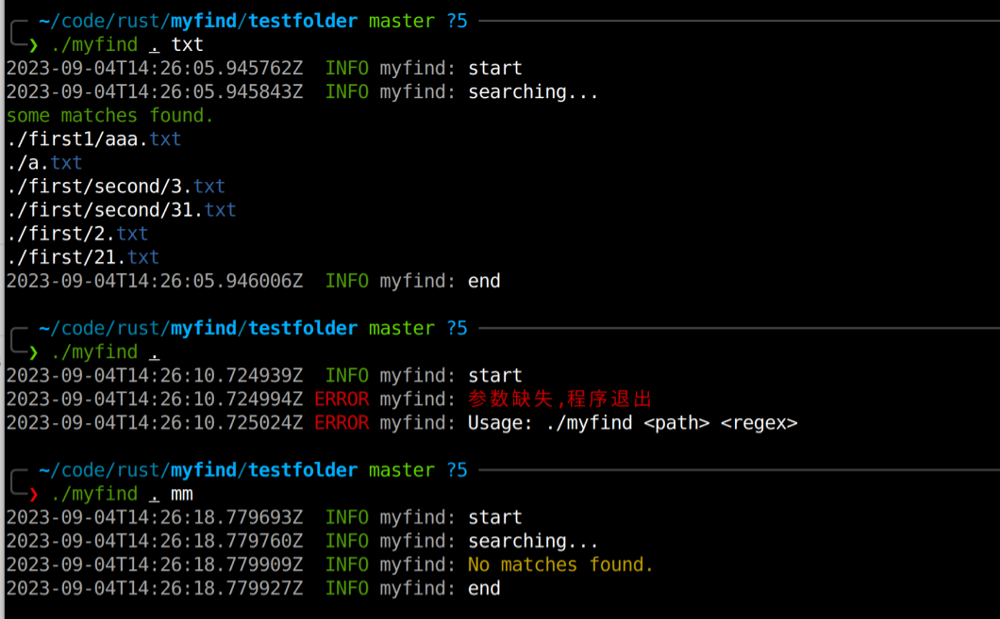

实现了

- 将代码重构到多个模块中

- 尝试使用 tracing 库打日志
- 支持命令行彩色输出

以下为用 testfolder 进行测试的结果

```shell
$tree         
.
├── a.txt
├── first
│   ├── 21.txt
│   ├── 2.txt
│   └── second
│       ├── 31.txt
│       ├── 3.txt
│       └── third
├── first1
│   └── aaa.txt
└── myfind

4 directories, 7 files

```


